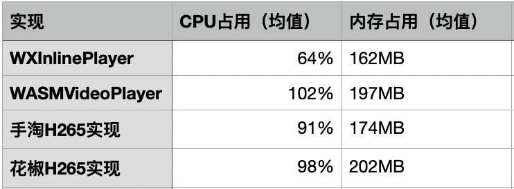

[](https://github.com/996icu/996.ICU/blob/master/LICENSE)

## Introduction

With the rise of live broadcasts and short videos, video has become a very mainstream method of outputting operational/product information because it carries a greater amount of information. However, due to the interests of various domestic browser manufacturers, they have placed many restrictions on the video capabilities of HTML5, not limited to：
1. Disable autoplay
2. The player is magically changed to a native player, which has the highest level and cannot be cascaded with HTML-related elements.
3. Advertising content inserted before and after playback
4. Video automatically pinned to top
5. Related APIs and event implementations are not unified
6. etc...

For specific questions, please refer to the article written by Tencent IMWeb team ["Mobile Terminal Video Mining Implementation of Complex Frame Animation"](https://juejin.im/post/5d513623e51d453b72147600)。

In order to solve these problems, we implemented WXInlinePlayer by soft decoding FLV. The third-party technology and platform API used are as follows:
1. [OpenH264](https://github.com/cisco/openh264) / [TinyH264](https://github.com/udevbe/tinyh264) / [de265](https://github.com/strukturag/libde265)
2. [emscripten](https://github.com/emscripten-core/emscripten)
3. [WebGL](https://developer.mozilla.org/zh-CN/docs/Web/API/WebGL_API)
4. [Web Audio Api](https://developer.mozilla.org/zh-CN/docs/Web/API/Web_Audio_API)

At the same time, we have also written a WebAssembly version of FLV Demuxer, you can [lib/codec](https://github.com/qiaozi-tech/WXInlinePlayer/tree/master/lib/codec) find the relevant code.

## Features

1. FLV H264/H265 on-demand/live broadcast fully supported
2. Freely choose decoding dependencies. In actual gzip, Tinyh264 only needs ~180k, OpenH264 ~260k, de265 ~210k
3. Specially optimized for mobile performance, with stable memory and CPU usage
4. Live broadcast delay optimization, 1-2s lower than MSE’s native Video implementation
5. Audio/video independent support
6. WeChat WebView automatic playback
7. Autoplay animation without audio
8. Good mobile WebView compatibility

## Сompatibility

The compatibility test uses the relevant models provided by the BrowserStack service, for reference only:
* Android 5+
* iOS 10+ （含Safari及WebView）
* Chrome 25+
* Firefox 57+
* Edge 15+
* Safari 10.1+

## How to compile

Please make sure you have installed:
* [parcel](https://parceljs.org/) 
* [emscripten 1.38.45](https://github.com/emscripten-core/emscripten) 
* [cmake](https://cmake.org/) 
* [make](http://www.gnu.org/software/make/)

And then execute the following command:
```shell
npm install
npm update
bash build.sh
```
The final product will be in the 'example' folder.

> Please note:
> * Please build in a *nix environment. Compilation of OpenH264 under Windows is not guaranteed.
> * Please make sure emscripten is in version 1.38.45, otherwise wasm32 errors will occur
> * cmake version needs to be 3.16+

## Quick start
```html
<!DOCTYPE html>
<html>
<head>
  <meta charset="UTF-8" />
  <title>WXInlinePlayer</title>
  <style>
    * {
      margin: 0;
      padding: 0;
    }

    html,
    body {
      width: 100%;
      height: 100%;
    }
  </style>
</head>
<body>
  <canvas id="container" width="800" height="450"></canvas>
  <script src="./index.js"></script>
  <script>
    if (WXInlinePlayer.isSupport()) {
      WXInlinePlayer.init({
        asmUrl: './prod.baseline.asm.combine.js',
        wasmUrl: './prod.baseline.wasm.combine.js'
      });

      WXInlinePlayer.ready().then(() => {
        const player = new WXInlinePlayer({
          url: 'https://static.petera.cn/mm.flv',
          $container: document.getElementById('container'),
          hasVideo: true,
          hasAudio: true,
          volume: 1.0,
          muted: false,
          autoplay: true,
          loop: true,
          isLive: false,
          chunkSize: 128 * 1024,
          preloadTime: 5e2,
          bufferingTime: 1e3,
          cacheSegmentCount: 64,
          customLoader: null
        });

        const { userAgent } = navigator;
        const isWeChat = /MicroMessenger/i.test(userAgent);
        if (!isWeChat) {
          alert('click to play!');
          document.body.addEventListener('click', () => {
            player.play();
          });
        }
      });
    }
  </script>
</body>
</html>
```

In the project root directory, enter the command to start the server:
```shell
npm run serve
```
Then enter the URL to access the demo:
```
http://localhost:8888/example/index.html
```

## API

### Boolean WXInlinePlayer.isSupport(void)

Whether the current execution environment supports WXInlinePlayer.
```javascript
if(WXInlinePlayer.isSupport()){
  console.log('WXInlinePlayer support');
}
```

### Promise WXInlinePlayer.init(Object)

To initialize WXInlinePlayer, you need to pass in the specific address of the loaded H264 decoding library.
```javascript
if(WXInlinePlayer.isSupport()){
  WXInlinePlayer.init({
    asmUrl: './prod.baseline.asm.combine.js',
    wasmUrl: './prod.baseline.wasm.combine.js'
  }).catch(e=>{
    console.log(`WXInlinePlayer init error: ${e}`);
  });
}
```

### Promise WXInlinePlayer.ready(void)

WXInlinePlayer is ready and can be initialized safely.

```javascript
if(WXInlinePlayer.isSupport()){
  WXInlinePlayer.init({/*.....*/});
  WXInlinePlayer.ready().then(()=>{
    console.log('WXInlinePlayer ready');
  });
}
```

### WXInlinePlayerInstance WXInlinePlayer(Object)

WXInlinePlayer constructor.

```javascript
WXInlinePlayer.ready().then(()=>{
  const player = new WXInlinePlayer({/*...*/});
});
```

### void WXInlinePlayerInstance.play(void)

Play video. It should be noted that due to browser limitations (excluding WeChat and Chrome versions below 66), higher versions have disabled audio automatic playback, so calling this method directly may not be effective. Please click/touchstart/touchend/touchmove, etc. Let users actively trigger events.

```javascript
document.body.addEventListener('click', ()=>{
  player.play();
});
```

### void WXInlinePlayerInstance.stop(void)

Stops the entire player and cannot be resumed.

```javascript
player.stop();
```

### void WXInlinePlayerInstance.pause(void)

Pause current playback.

```javascript
player.pause();
```

### void WXInlinePlayerInstance.resume(void)

Resumes a paused operation caused by pause.

```javascript
player.resume();
```

### Number|void WXInlinePlayerInstance.volume(Number|void)

Get/set the current volume.
```javascript
const volume = player.volume(); // get volume
player.volume(volume); // set volume
```

### Boolean|void WXInlinePlayerInstance.mute(Boolean|void)

Get/set mute status.
```javascript
const muted = player.mute(); // get mute
player.mute(muted); // set mute
```

### void WXInlinePlayerInstance.destroy(void)

Destroy the player and release all memory for recycling.
```javascript
player.destroy();
```

### Number WXInlinePlayerInstance.getCurrentTime(void)

Get the current playback time. Please note that there may be negative values, so please handle them carefully.
```javascript
player.on('timeUpdate', ()=>{
  let currentTime = player.getCurrentTime();
  currentTime = currentTime <= 0 ? 0 : currentTime;
});
```

### Number WXInlinePlayerInstance.getAvaiableDuration(void)

The playable duration can be understood as the buffering duration.
```javascript
player.on('timeUpdate', ()=>{
  const duration = player.getAvaiableDuration();
});
```

## Event

* mediaInfo(Object) - Video related information, such as width/height/fps/framerate, etc.
* playing(void) - Start/Now Playing
* buffering(void) - Insufficient internal frame data, buffering started
* stopped(void) - Stop play
* end(void) - End of play
* timeUpdate(currentTime:Number) - Current playback progress, triggered once every 250ms
* loadError({status:Number, statusText:String, detail:Object}) - Failed to load
* loadSuccess(void) - Loading successfully
* performance({averageDecodeCost:Number, averageUnitDuration:Number}) - Encoding performance detection event, averageDecodeCost represents the average decoding time, averageUnitDuration represents the playable unit duration obtained by decoding under averageDecodeCost

## How to choose decoding dependencies

There are currently 3 sets of decoding libraries, namely:
* prod.baseline.asm.combine / prod.baseline.wasm.combine
* prod.all.asm.combine / prod.all.wasm.combine
* prod.h265.asm.combine / prod.h265.wasm.combine

The difference is:
1. The baseline file size is smaller (80k smaller than all after gzip), but only supports baseline profiles.
2. all's profile supports more complete (baseline/main/high), and its performance is better than baseline
2. h265 mainly supports h265 flv stream. This implementation expands the FLV format and refers to Kingsoft’s expansion requirements. If you have such needs, please refer to [金山的FLV拓展规范](https://github.com/ksvc/FFmpeg/wiki)

We recommend using baseline.asm/baseline.wasm when you play advertising videos/marketing videos/small animation videos that are sensitive to the size of the dependent library, and use it when playing on-demand videos/live videos that are not sensitive to the size of the dependent library. all.asm/all.wasm.

## Performance comparison
On the development machine, for the same video, WXInlinePlayer and FFMpeg implementations such as Taobao and Huajiao have similar memory usage and CPU usage. The overall performance of WXInlinePlayer is about 5-10% better than the FFMpeg solution, while H265 has reduced deblocking. Its performance is about 30% better than the FFMpeg solution. The following is a comparison of H265 playback performance:



## How to reduce lag and latency

WXInlinePlayer's lags and delays mainly come from three places:
* Network loading delay
* Soft decoding delay
* Rendering delay

Generally speaking, if the user's network environment is good, it is difficult to cause a bottleneck due to the use of WebGL in rendering (the operation is very simple), which generally causes constant lags and delays due to insufficient soft decoding performance.

To optimize the delay caused by insufficient soft decoding performance, we generally start from several places:
1. Video profile: Compared with main/high, baseline does not include B frames and has lower decoding consumption.
2. Video frame rate: Too high a frame rate will cause the software decoding to be unable to keep up. You can try lowering the frame rate, such as 24fps.
3. Video bit rate: The higher the bit rate, the more details the video will contain and the clearer it will be, but it will consume more decoding performance. You can try to lower the bit rate.
4. Video resolution: Too high a video will cause a huge number of single frames to be transmitted

Currently, WXInlinePlayer can decode 1280x720, code rate 1024, and frame rate 24fps videos on mid-to-high-end machines relatively smoothly.

Regarding the video parameters mentioned above, you can view them through FFmpeg:
```shell
ffmpeg -i "your.flv"
```

Here we give the profile/frame rate/code rate/resolution of mainstream platforms for reference:

platform | type | definition | profile | frame rate | bitrate | resolution
 -|-|-|-|-|-|-
Huya|Horizontal|SD|High|24|500k|800x450
Huya|Horizontal|HD|High|24|1200k|1280x720
Huya|Vertical|HD|Main|16|1280k|540x960
Qixiu|Vertical screen|SD|High|15|307k|204x360
Qixiu|Vertical screen|HD|High|15|512k|304x540
Qixiu|Vertical screen|Ultra HD|Baseline|15|1440k|720x1280
Douyin|Vertical screen|Default|High|30|1600k (more changes, for reference only)|720x1280
Kuaishou | Vertical screen | Default | High | 25 | 2880k (more changes, for reference only) | 720x1280

We recommend you:
1. If you want to be able to cover more models, then Qixiu SD or HD configuration is suitable for you
2. If you want to support only mid-to-high-end Android phones and iPhone6+, then Huya HD configuration is suitable for you

Our commonly used low-latency configuration parameters of WXInlinePlayer are as follows, for reference only. Please adjust according to your live stream/on-demand file configuration:
```javascript
{
  chunkSize: 128 * 1024,
  preloadTime: 5e2,
  bufferingTime: 1e3,
  cacheSegmentCount: 64,
}
```

At the same time, you can use **performance events** to determine the current decoding performance, and then prompt the user and downgrade to your backup solution (such as direct video playback/static images/sequence frames, etc.):
```javascript
player.on('performance', ({averageDecodeCost, averageUnitDuration})=>{
  const prop = averageUnitDuration / averageDecodeCost;
  if(prop >= 2.0){
    console.log('good performance');
  }else if(prop < 2.0 && prop >= 1.0){
    console.log('ok, thats fine');
  }else{
    console.log('bad performance');
  }
});
```

## Other problems
* *Why not compile emscripten after FFmpeg minification?*

The FFmpeg solution currently has several major problems. The first is the size of the decoding library. After reduction, it is about 2M and gzip is about 600k. This is unacceptable for products that care about the size of the dependent library. Secondly, FFmpeg's solution is difficult to optimize by yourself. For example, WXInlinePlayer will do multiple worker decoding in 2.0, which is very costly to modify such a solution.

* *Why do some machines freeze frequently when playing on-demand/live broadcasts? How to solve it?*

The reasons for lagging and delay are more complicated. For WXInlinePlayer, the general situation is that the decoding speed cannot keep up with the playback speed. 

* *Why not support UC Browser (iOS/Android)?*

Both iOS and Android UC have castrated WebAssembly/ASM.js, so they simply do not support it.

* *How to convert existing video files into files playable by WXInlinePlayer?*

Please use FFmpeg or other similar tools. Here is a simple command example:
```shell
ffmpeg -i "your.mp4" -vcodec libx264 -acodec aac out.flv
```

* *How to encode H265 FLV?*

WXInlinePlayer's FLV specification follows [Kingsoft’s FLV expansion specifications](https://github.com/ksvc/FFmpeg/wiki)，if relevant coding is required，you can refer to its related [FFmpeg patch](https://github.com/ksvc/FFmpeg/wiki/instructions) or [Codec written by Kingsoft](https://github.com/ksvc/ks265codec)